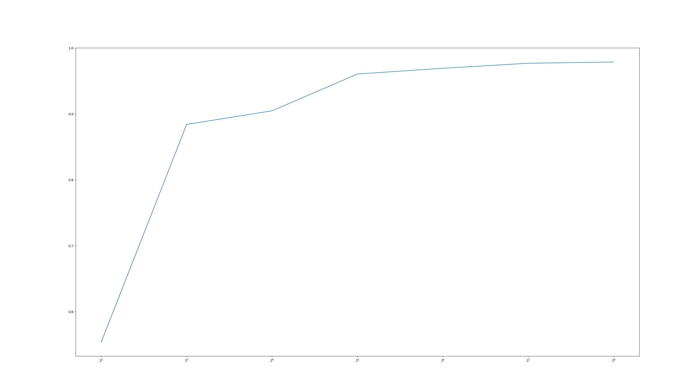

# MNIST 20 epochs test

```python
import torch
import torchvision
import torch.nn as nn
import torch.nn.functional as F
import torch.optim as optim

#net parameters 
num_epochs = 20
batch_size_train = 64
batch_size_test = 1000
learning_rate = 0.01
momentum = 0.5 #gradient descent with momentum
log_interval = 10

random_seed = 1
torch.backends.cudnn.enabled = False
torch.manual_seed(random_seed)

#dataloader
train_loader = torch.utils.data.DataLoader(
  torchvision.datasets.MNIST('./data_set/', train=True, download=False,
                             transform=torchvision.transforms.Compose([
                               torchvision.transforms.ToTensor(),
                               torchvision.transforms.Normalize(
                                 (0.1307,), (0.3081,))
                             ])),
  batch_size=batch_size_train, shuffle=True)

test_loader = torch.utils.data.DataLoader(
  torchvision.datasets.MNIST('./data_set/', train=False, download=False,
                             transform=torchvision.transforms.Compose([
                               torchvision.transforms.ToTensor(),
                               torchvision.transforms.Normalize(
                                 (0.1307,), (0.3081,))
                             ])),
  batch_size=batch_size_test, shuffle=True)


# Net structure
class Net(nn.Module):#
    def __init__(self):
        super(Net, self).__init__()

        #
        self.conv1 = nn.Conv2d(1, 10, kernel_size=5)
        self.conv2 = nn.Conv2d(10, 20, kernel_size=5)
        self.conv2_drop = nn.Dropout2d()
        self.fc1 = nn.Linear(320, 50)
        self.fc2 = nn.Linear(50, 10)
    def forward(self, x):
        x = F.relu(F.max_pool2d(self.conv1(x), 2))
        x = F.relu(F.max_pool2d(self.conv2_drop(self.conv2(x)), 2))
        x = x.view(-1, 320)
        x = F.relu(self.fc1(x))
        x = F.dropout(x, training=self.training)
        x = self.fc2(x)
        return F.log_softmax(x)

#Run Net
network = Net()
optimizer = optim.SGD(network.parameters(), lr=learning_rate,
                      momentum=momentum)
train_losses = []
train_counter = []
test_losses = []
test_counter = [i*len(train_loader.dataset) for i in range(num_epochs + 1)]

#Train process 
def train(epoch):
  network.train()
  for batch_idx, (data, target) in enumerate(train_loader):
    optimizer.zero_grad()
    output = network(data)
    loss = F.nll_loss(output, target)
    loss.backward()
    optimizer.step()
    if batch_idx % log_interval == 0:
      print('Train Epoch: {} [{}/{} ({:.0f}%)]\tLoss: {:.6f}'.format(
        epoch, batch_idx * len(data), len(train_loader.dataset),
        100. * batch_idx / len(train_loader), loss.item()))
      train_losses.append(loss.item())
      train_counter.append(
        (batch_idx*64) + ((epoch-1)*len(train_loader.dataset)))
      torch.save(network.state_dict(), './model.pth')
      torch.save(optimizer.state_dict(), './optimizer.pth')

#Test Network
def test():
  network.eval()
  test_loss = 0
  correct = 0
  with torch.no_grad():
    for data, target in test_loader:
      output = network(data)
      test_loss += F.nll_loss(output, target, size_average=False).item()
      pred = output.data.max(1, keepdim=True)[1]
      correct += pred.eq(target.data.view_as(pred)).sum()
  test_loss /= len(test_loader.dataset)
  test_losses.append(test_loss)
  print('\nTest set: Avg. loss: {:.4f}, Accuracy: {}/{} ({:.0f}%)\n'.format(
    test_loss, correct, len(test_loader.dataset),
    100. * correct / len(test_loader.dataset)))

#Train network and then get performance
test()
for epoch in range(1, num_epochs + 1):
    train(epoch)
    test()
import matplotlib.pyplot as plt
fig = plt.figure()
plt.plot(train_counter, train_losses, color='blue')
plt.scatter(test_counter, test_losses, color='red')
plt.legend(['Train Loss', 'Test Loss'], loc='upper right')
plt.xlabel('number of training examples seen')
plt.ylabel('negative log likelihood loss')

#Get resualt
examples = enumerate(test_loader)
batch_idx, (example_data, example_targets) = next(examples)
with torch.no_grad():
    output = network(example_data)
fig = plt.figure()
for i in range(6):
    plt.subplot(2, 3, i + 1)
    plt.tight_layout()
    plt.imshow(example_data[i][0], cmap='gray', interpolation='none')
    plt.title("Prediction: {}".format(output.data.max(1, keepdim=True)[1][i].item()))
    plt.xticks([])
    plt.yticks([])
plt.show()
```


Accuracy after 20 epochs: 99%

# KNN

```python
import numpy as np
import torch.utils.data
import torchvision.transforms
from torch.utils.data import DataLoader
from torchvision import datasets
import cv2
from sklearn.neighbors import KNeighborsClassifier
import matplotlib.pyplot as plt
import torch.nn as nn
from tqdm import tqdm
#load dataset
train_set=datasets.MNIST(root="../../dataset/train_data",train=True,download=True,transform=torchvision.transforms.ToTensor())
test_set=datasets.MNIST(root="../../dataset/test_data",train=False,download=True,transform=torchvision.transforms.ToTensor())

def knn_test():
    acc_all = []
    for k in range(1,11):
        print(k)
        classifier = KNeighborsClassifier(n_neighbors=k, algorithm='kd_tree',p=1, n_jobs=-1)
        knn = classifier.fit(train_img.reshape(60000,-1), train_label)
        acc = knn.score(test_img.reshape(10000,-1), test_label)
        acc_all.append(acc)
    acc_all = np.array(acc_all)
    plt.plot(np.arange(1,11), acc_all)
    plt.show()


train_img, train_label = train_set.data, train_set.targets
test_img, test_label = test_set.data, test_set.targets
knn_test()
# test_data =np.load("../input/test_data.npy") #import test data
# test_label = np.load("../input/test_labels.npy") #import test labesls
```


# MLP

```python
import numpy as np
import torch.utils.data
import torchvision.transforms
from torch.utils.data import DataLoader
from torchvision import datasets
import cv2
from sklearn.neighbors import KNeighborsClassifier
import matplotlib.pyplot as plt
import torch.nn as nn
from tqdm import tqdm
#load dataset
train_set=datasets.MNIST(root="../../dataset/train_data",train=True,download=True,transform=torchvision.transforms.ToTensor())
test_set=datasets.MNIST(root="../../dataset/test_data",train=False,download=True,transform=torchvision.transforms.ToTensor())


class MLP(nn.Module):
    def __init__(self, hidden_layer):
        super(MLP, self).__init__()
        self.model = nn.Sequential(
            nn.Linear(28*28, hidden_layer),
            nn.ReLU(True),
            nn.Linear(hidden_layer, hidden_layer),
            nn.ReLU(True),
            nn.Linear(hidden_layer, hidden_layer),
            nn.ReLU(True),
            nn.Linear(hidden_layer, 10),
        )

    def forward(self, x):
        out = self.model(x)
        return out

def mlp_test():
    batch_size = 64
    data_loader_train = torch.utils.data.DataLoader(dataset=train_set, batch_size = batch_size, shuffle=True)
    # data_loader_test = torch.utils.data.DataLoader(dataset=test_set, batch_size=batch_size, shuffle=False)
    epoch_num = 20
    acc_all = []
    for hidden_layer in [4,8,16,32,64,128,256]:
        model = MLP(hidden_layer).to('cuda')
        model.train()
        optimizer = torch.optim.Adam(model.parameters())
        loss_fuc = nn.CrossEntropyLoss()
        for epoch in tqdm(range(epoch_num)):
            for i, (train_img, train_label) in enumerate(data_loader_train):
                optimizer.zero_grad()
                pred = model(train_img.reshape(train_img.shape[0],-1).to('cuda'))
                loss = loss_fuc(pred,train_label.to('cuda'))
                loss.backward()
                optimizer.step()
        model.eval()
        test_pred = model(test_img.reshape(test_img.shape[0],-1).float().to('cuda'))
        acc = (test_pred.argmax(dim=1) == test_label.to('cuda')).sum() / test_label.shape[0]
        acc_all.append(acc.detach().cpu().numpy())
    acc_all = np.array(acc_all)
    plt.plot(np.array([4,8,16,32,64,128,256]), acc_all)
    plt.xscale('log',base=2)
    plt.show()

train_img, train_label = train_set.data, train_set.targets
test_img, test_label = test_set.data, test_set.targets
mlp_test()

```



# CNN

```python
import numpy as np
import torch.utils.data
import torchvision.transforms
from torch.utils.data import DataLoader
from torchvision import datasets
import cv2
from sklearn.neighbors import KNeighborsClassifier
import matplotlib.pyplot as plt
import torch.nn as nn
from tqdm import tqdm
#load dataset
train_set=datasets.MNIST(root="../../dataset/train_data",train=True,download=False,transform=torchvision.transforms.ToTensor())
test_set=datasets.MNIST(root="../../dataset/test_data",train=False,download=False,transform=torchvision.transforms.ToTensor())


class LENET(nn.Module):
    def __init__(self):
        super(LENET, self).__init__()
        self.layer1 = nn.Sequential(
            nn.Conv2d(1, 6, kernel_size=5, stride=1, padding=0),
            nn.BatchNorm2d(6),
            nn.Tanh(),
            nn.AvgPool2d(kernel_size=2, stride=2))
        self.layer2 = nn.Sequential(
            nn.Conv2d(6, 16, kernel_size=5, stride=1, padding=0),
            nn.BatchNorm2d(16),
            nn.Tanh(),
            nn.AvgPool2d(kernel_size=2, stride=2))
        self.fc = nn.Linear(256, 120)
        self.relu = nn.Tanh()
        self.fc1 = nn.Linear(120, 84)
        self.relu1 = nn.Tanh()
        self.fc2 = nn.Linear(84, 10)
        self.softmax = nn.Softmax()

    def forward(self, x):
        out = self.layer1(x)
        out = self.layer2(out)
        out = out.reshape(out.size(0), -1)
        out = self.fc(out)
        out = self.relu(out)
        out = self.fc1(out)
        out = self.relu1(out)
        out = self.fc2(out)
        return out

def cnn_test():
    batch_size = 64
    data_loader_train = torch.utils.data.DataLoader(dataset=train_set, batch_size = batch_size, shuffle=True)
    data_loader_test = torch.utils.data.DataLoader(dataset=test_set, batch_size=batch_size, shuffle=False)
    epoch_num = 20
    model = LENET().to('cuda')
    model.train()
    optimizer = torch.optim.Adam(model.parameters())
    loss_fuc = nn.CrossEntropyLoss()
    for epoch in tqdm(range(epoch_num)):
        for i, (train_img, train_label) in enumerate(data_loader_train):
            optimizer.zero_grad()
            pred = model(train_img.to('cuda'))
            loss = loss_fuc(pred,train_label.to('cuda'))
            loss.backward()
            optimizer.step()
    model.eval()
    test_pred = model(test_img.float().unsqueeze(1).to('cuda'))
    acc = (test_pred.argmax(dim=1) == test_label.to('cuda')).sum() / test_label.shape[0]
    print(acc)


train_img, train_label = train_set.data, train_set.targets
test_img, test_label = test_set.data, test_set.targets
cnn_test()

```

Run for 2 times

First round  0.9815

Second round 0.9591


# CAN


```python
import numpy as np
import torch.utils.data
import torchvision.transforms
from torch.utils.data import DataLoader
from torchvision import datasets
import cv2
from sklearn.neighbors import KNeighborsClassifier
import matplotlib.pyplot as plt
import torch.nn as nn
from tqdm import tqdm
#load dataset
train_set=datasets.MNIST(root="../../dataset/train_data",train=True,download=False,transform=torchvision.transforms.ToTensor())
test_set=datasets.MNIST(root="../../dataset/test_data",train=False,download=False,transform=torchvision.transforms.ToTensor())

class CAN(nn.Module):
    def __init__(self,feature_channel):
        super(CAN, self).__init__()
        self.layer1 = nn.Sequential(
            nn.Conv2d(1, feature_channel, kernel_size=3, dilation=1, padding=1),
            nn.LeakyReLU())
        self.layer2 = nn.Sequential(
            nn.Conv2d(feature_channel, feature_channel, kernel_size=3, dilation=2, padding=2),
            nn.LeakyReLU())
        self.layer3 = nn.Sequential(
            nn.Conv2d(feature_channel, feature_channel, kernel_size=3, dilation=4, padding=4),
            nn.LeakyReLU())
        self.layer4 = nn.Sequential(
            nn.Conv2d(feature_channel, feature_channel, kernel_size=3, dilation=8, padding=8),
            nn.LeakyReLU())
        self.layer5 = nn.Sequential(
            nn.Conv2d(feature_channel, 10, kernel_size=3, dilation=1, padding=1),
            nn.LeakyReLU())
        self.ave_pool = nn.AvgPool2d(28)

    def forward(self, x):
        out = self.layer1(x)
        out = self.layer2(out)
        out = self.layer3(out)
        out = self.layer4(out)
        out = self.layer5(out)
        out = self.ave_pool(out)

        return out[:,:,0,0]

def can_test():
    batch_size = 64
    data_loader_train = torch.utils.data.DataLoader(dataset=train_set, batch_size = batch_size, shuffle=True)
    data_loader_test = torch.utils.data.DataLoader(dataset=test_set, batch_size=batch_size, shuffle=False)
    epoch_num = 20
    acc_all = []
    for feature_channel in [4,8,16,32,64,128,256]:
        model = CAN(feature_channel).to('cuda')
        model.train()
        optimizer = torch.optim.Adam(model.parameters())
        loss_fuc = nn.CrossEntropyLoss()
        for epoch in tqdm(range(epoch_num)):
            for i, (train_img, train_label) in enumerate(data_loader_train):
                optimizer.zero_grad()
                pred = model(train_img.to('cuda'))
                loss = loss_fuc(pred,train_label.to('cuda'))
                loss.backward()
                optimizer.step()
        model.eval()
        right_num = 0
        for i, (test_img, test_label) in enumerate(data_loader_test):
            test_pred = model(test_img.to('cuda'))
            acc = (test_pred.argmax(dim=1) == test_label.to('cuda')).sum() / test_label.shape[0]
            right_num += (test_pred.argmax(dim=1) == test_label.to('cuda')).sum()
        acc = right_num / test_set.targets.shape[0]
        acc_all.append(acc.detach().cpu().numpy())
    acc_all = np.array(acc_all)
    plt.plot(np.array([4,8,16,32,64,128,256]), acc_all)
    plt.xscale('log',base=2)
    plt.show()


train_img, train_label = train_set.data, train_set.targets
test_img, test_label = test_set.data, test_set.targets
can_test()

```
